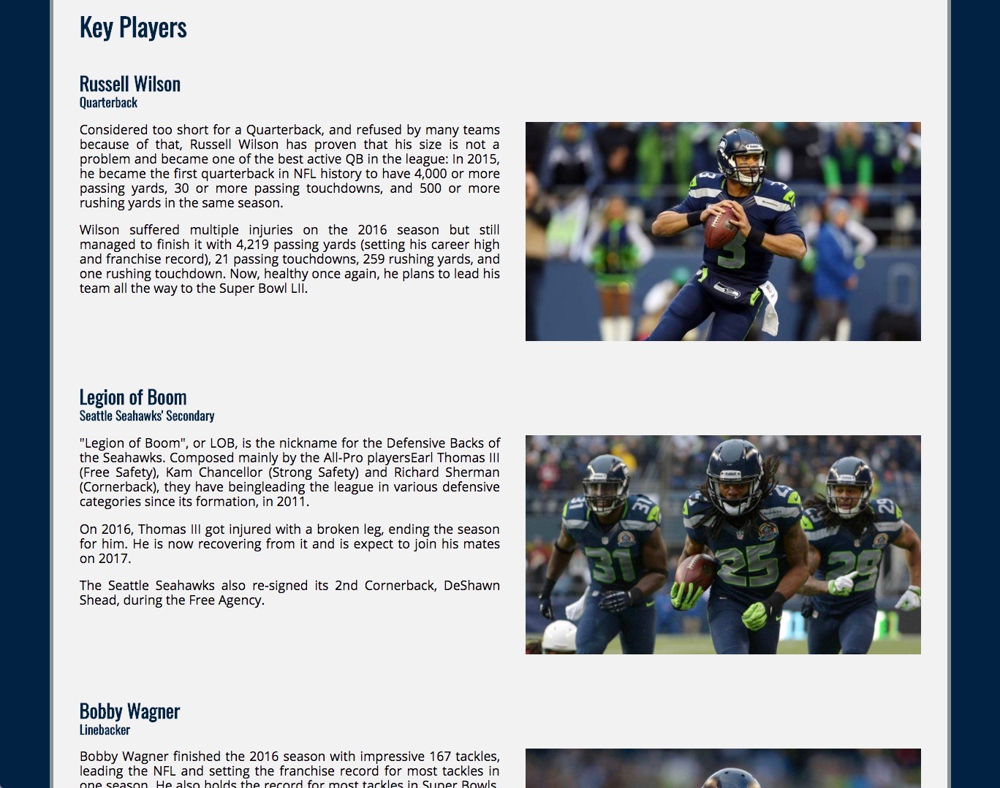
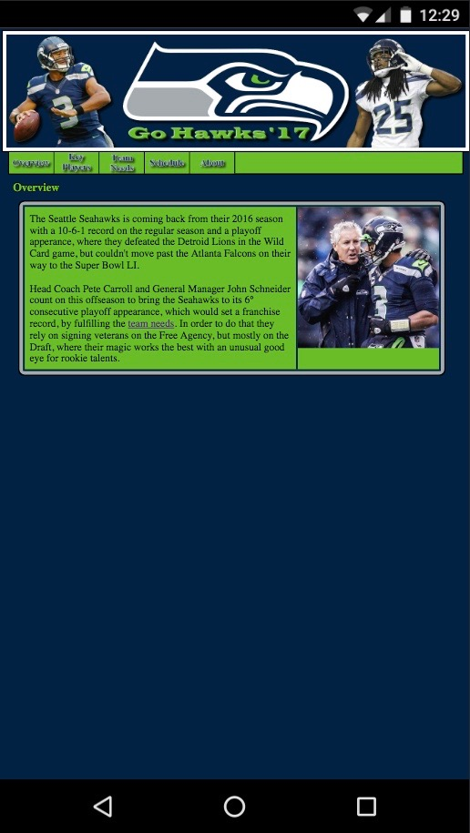
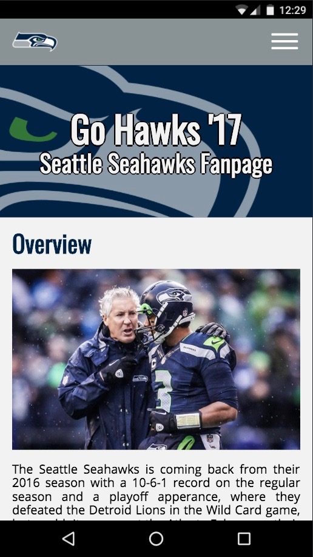

# Go Hawks '17 #
A Seattle Seahawks fanpage with my predictions for their 2017 season.

## Backstory ##
This project was part of my Intro to Programming Nanodegree at Udacity in early 2017 and my first contact with code. For that reason I was very proud of it, even though it looked **painfully awful** (as one would expect from a first-timer).

The idea was to create a website using the basics of HTML and CSS we had just learned. Back at the time I didn't know anything about *Responsive Design* or *JavaScript*, never heard of *CSS Preprocessors* or *Template Engines* and would probably have had a meltdown if I've heard anyone mentioning a *Cloud Platform*.

## Update Time ##
One year later I've decided for a redesign and to use some of the technologies I've learned during this time so I would finally be able to show it to someone else without hurting their eyes.

The idea was to implement the following:

- **A complete redesign**
- **Responsive Design** - Automatically adapt to the device's screen size
- **Sass/SCSS** - CSS Preprocessor
- **Express** - Web Framework
- **Pug** - Template Engine
- **Deploy to Heroku** - Cloud Platform

*I also tried to keep changes to the original content to a minumium, even though my predictions turned out to be terribly wrong.*

## Results ##

### Desktop View ###

______________________________________________

### Mobile ###

  
  

